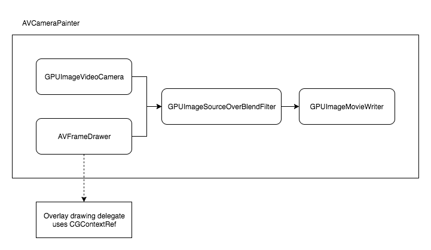

VideoCaptureOverlay
===================

This is an example of how to capture camera with dynamic overlay. Video overlay can be created in real time using CoreGraphics drawing routines. 
```objc
frameDrawer = [[AVFrameDrawer alloc] initWithSize:CGSizeMake(targetWidth, targetHeight)
                               contextInitailizeBlock:contextInitialization];
    
    frameDrawer.contextUpdateBlock = ^BOOL(CGContextRef context, CGSize size, CMTime time) {

        //
        // video overlay CoreGraphics code goes here
        //
        
        return YES; // return YES if context was modified
    };
```

#### Architecture


#### Todo's
- [ ] Test on iPhone 7,8,X
